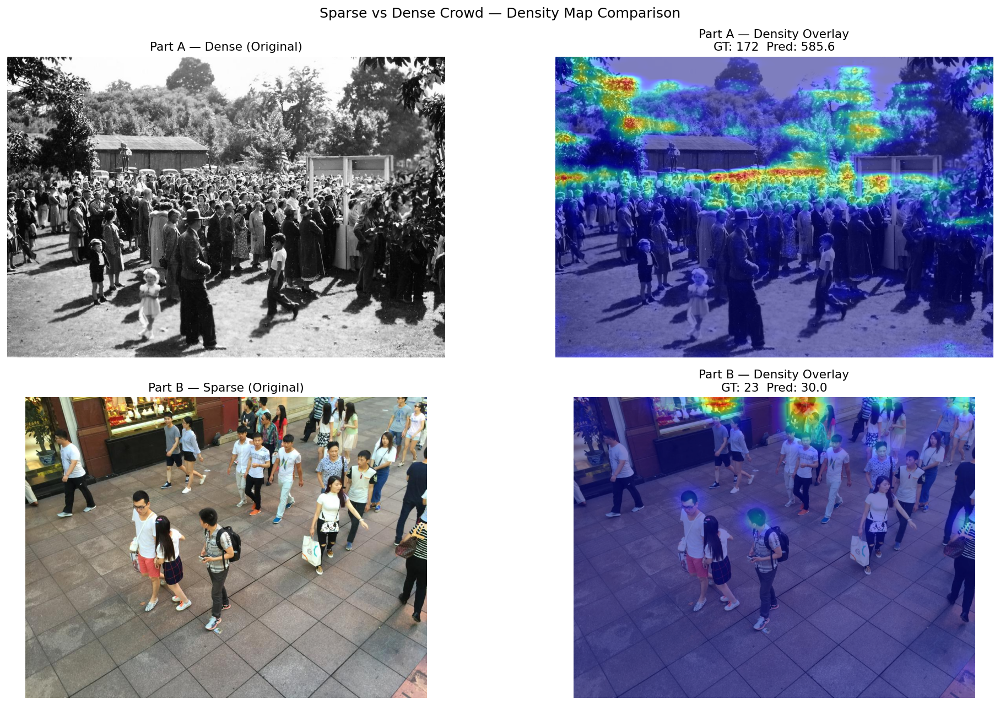

# Project V3.1 — Crowd Density Estimation with CSRNet

> Real-time crowd density heatmap and count estimation using CSRNet  
> (VGG-16 frontend + dilated CNN backend) on ShanghaiTech Part A & B.

---

## Demo

<!-- Replace with your actual GIF/screenshot after recording -->


---

## Results

| Dataset       | Crowd Type | MAE ↓  | RMSE ↓  | Test Images |
|---------------|------------|--------|---------|-------------|
| ShanghaiTech Part A | Dense  | 87.85  | 137.21  | 182         |
| ShanghaiTech Part B | Sparse | 21.12  | 37.97   | 316         |

> Trained from scratch on M1 MacBook Air CPU. No GPU used.

---

## Architecture
```
Input Image
    │
    ▼
Frontend: VGG-16 (first 10 conv layers, pretrained ImageNet)
    │         ↓ stride 8
    ▼
Backend: 6 × Dilated Conv (dilation=2) → 1×1 Conv
    │
    ▼
Density Map (H/8 × W/8) — sum = predicted crowd count
```

---

## What I Learned

- Density map regression as an alternative to direct object counting
- Adaptive vs fixed Gaussian kernel generation for ground truth maps
- Dilated convolutions for multi-scale context without resolution loss
- MAE/MSE evaluation for count estimation tasks
- Real-time density heatmap overlay pipeline on video streams

---

## Dataset

**ShanghaiTech** — Part A (dense, 482 images) and Part B (sparse, 716 images)  
Download: [Google Drive](https://drive.google.com/file/d/16dhJn7k4FWVwByRsQAEpl9lwjuV03jVI/view)

After downloading, place at:
```
datasets/ShanghaiTech/
├── part_A/
│   ├── train_data/{images, ground_truth}
│   └── test_data/{images, ground_truth}
└── part_B/
    ├── train_data/{images, ground_truth}
    └── test_data/{images, ground_truth}
```

---

## Setup
```bash
conda create -n csrnet python=3.10 -y
conda activate csrnet
pip install torch torchvision torchaudio
pip install opencv-python scipy matplotlib PyYAML tqdm
```

---

## Usage

### 1 — Generate Density Maps
```bash
python scripts/generate_density_maps.py --config configs/config.yaml --part both
```

### 2 — Train
```bash
# Train Part B first (faster), then Part A overnight
caffeinate -i python src/train.py --config configs/config.yaml --part B
caffeinate -i python src/train.py --config configs/config.yaml --part A
```

### 3 — Evaluate
```bash
python src/evaluate.py --config configs/config.yaml
```

### 4 — Video Demo
```bash
# Place crowd video at inputs/crowd_video.mp4, then:
python scripts/inference_video.py --config configs/config.yaml --part A
# Output: outputs/video/demo_output.mp4
```

---

## Tech Stack

| Component     | Choice                              |
|---------------|-------------------------------------|
| Framework     | PyTorch                             |
| Frontend      | VGG-16 (torchvision, pretrained)    |
| Backend       | Dilated CNN (6 layers, dilation=2)  |
| Dataset       | ShanghaiTech Part A & B             |
| Kernels       | Adaptive (Part A) / Fixed (Part B)  |
| Training      | M1 CPU, batch=1, Adam, 200 epochs   |
| Inference     | M1 MPS                              |
| Environment   | conda, Python 3.10                  |

---

## Project Structure
```
crowd-density-estimation-csrnet/
├── configs/config.yaml         # all parameters — no hardcoded values
├── src/
│   ├── dataset.py              # CrowdDataset with augmentation
│   ├── model.py                # CSRNet architecture
│   ├── train.py                # training loop
│   ├── evaluate.py             # MAE/MSE + visualisations
│   └── utils.py                # shared utilities
├── scripts/
│   ├── generate_density_maps.py
│   ├── inspect_dataset.py
│   ├── validate_density_maps.py
│   ├── check_model.py
│   ├── inference_video.py
│   └── plot_training_curves.py
└── outputs/
    ├── evaluation/             # figures, CSVs, comparison panels
    └── video/                  # demo MP4
```